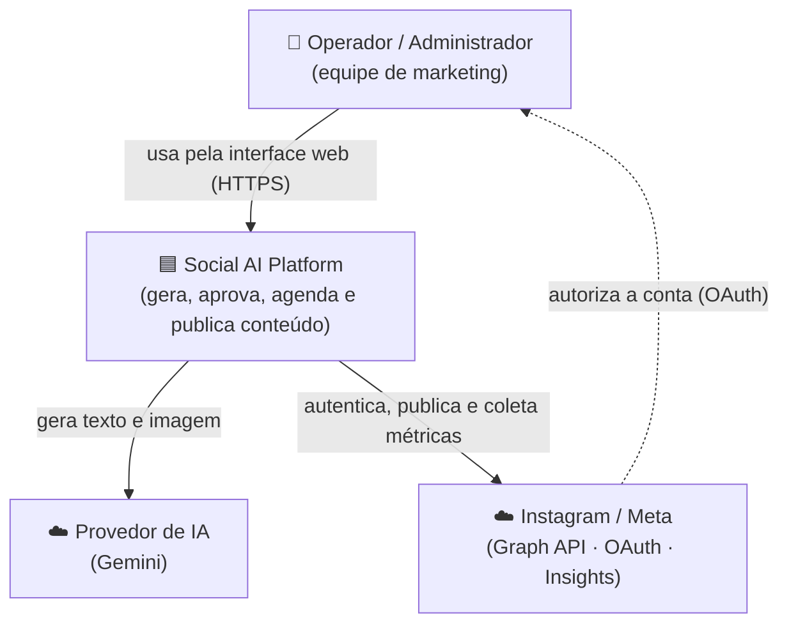
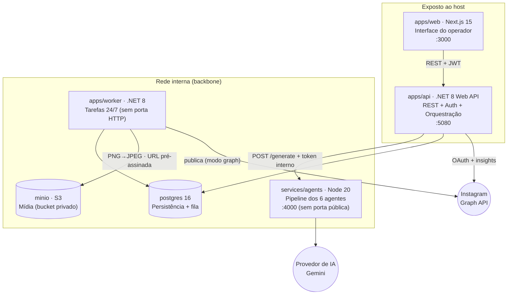
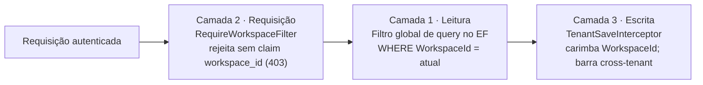
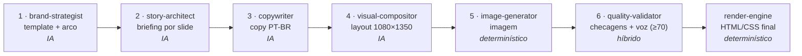
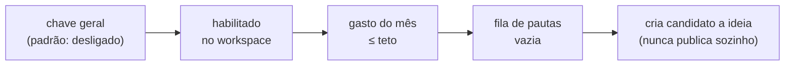

# Arquitetura — Social AI Platform

Documento de arquitetura canônico. Descreve o sistema como ele é: contexto, contêineres,
componentes, fluxos de dados, decisões e atributos de qualidade. Organizado em camadas do modelo
[C4](https://c4model.com/) (Contexto → Contêineres → Componentes), do mais externo ao mais interno.

Para subir e operar, ver [README.md](README.md) e [docs/DEPLOYMENT.md](docs/DEPLOYMENT.md). Para os
fatos tabelados (variáveis, rotas, enums, jobs), ver [docs/sot/06-referencia.md](docs/sot/06-referencia.md).
Para as decisões em detalhe, ver [docs/adr/](docs/adr/).

---

## 1. Visão executiva

A Social AI Platform é uma aplicação **self-hosted** e **multi-tenant** que gera, aprova, agenda e
publica conteúdo de Instagram a partir de um briefing editorial, usando um pipeline de seis agentes
de IA. Um loop autônomo opcional aprende com o desempenho das publicações e propõe novas ideias
quando a fila editorial esvazia.

O sistema é um **monorepo** com quatro serviços de aplicação e duas dependências de infraestrutura
(seis contêineres no Docker Compose, ao todo),
orquestrados por Docker Compose. Cada cliente recebe seu próprio deploy (um deploy por cliente), e o
mesmo código atende tanto a um único workspace (single-tenant) quanto a vários (multi-tenant),
selecionável por configuração.

**Princípios que governam o desenho:**

| Princípio | Como se manifesta |
|-----------|-------------------|
| **Isolamento por cliente é inviolável** | Toda tabela com dados de cliente carrega `WorkspaceId`; o isolamento é imposto em três camadas independentes (ver §4.1). |
| **Modo degradado é um estado de primeira classe** | Sem chaves de IA ou Meta, a infraestrutura, a interface, a autenticação e o CRUD funcionam; apenas a geração e a publicação real ficam indisponíveis. |
| **Aprovação humana antes de publicar** | Por padrão, nada vai ao ar sem decisão de um operador. O loop autônomo nunca publica sozinho. |
| **Alternar simulado/real é configuração, não código** | A troca do publicador simulado para o real é uma variável de ambiente. |
| **Progresso é real, nunca simulado** | A barra de progresso da geração reflete o estado verdadeiro do trabalho assíncrono. |

---

## 2. Contexto do sistema (C4 — Nível 1)

Quem usa o sistema e com quais sistemas externos ele conversa.



| Ator / sistema | Papel | Limite |
|----------------|-------|--------|
| **Operador / Administrador** | Cria pautas, dispara geração, aprova conteúdo, agenda, conecta o Instagram. | Externo — interage só pela interface web. |
| **Provedor de IA (Gemini)** | Gera o texto e as imagens do conteúdo. | Externo — sem chave, o sistema opera em modo degradado. |
| **Instagram / Meta** | Autenticação OAuth, publicação via Graph API v22.0, coleta de insights. | Externo — sem credenciais, a publicação cai no modo simulado. |

---

## 3. Contêineres (C4 — Nível 2)

Os quatro serviços de aplicação e as duas dependências de infraestrutura. Cada serviço é um runtime
independente, com um único motivo para existir.



| Contêiner | Runtime | Responsabilidade única | Porta | Conversa com |
|-----------|---------|------------------------|-------|--------------|
| **web** | Next.js 15 (App Router) | Interface do operador: dashboard, marca, pautas, geração, aprovação, calendário, conexão Instagram. | 3000 | api |
| **api** | .NET 8 Web API | Autenticação, multi-tenancy, CRUD, orquestração da geração, OAuth do Instagram. | 5080 | postgres, agents, Instagram |
| **worker** | .NET 8 Worker | Tarefas periódicas 24/7: agendar → publicar → coletar métricas → loop autônomo → renovar token. | — | postgres, minio, Instagram |
| **agents** | Node 20 + TypeScript (Fastify) | Pipeline assíncrono de geração (6 agentes). Serviço interno, sem porta publicada. | 4000 (interno) | provedor de IA |
| **postgres** | PostgreSQL 16 | Persistência (EF Core) **e** fila de publicação (tabela `PublishLog`). | 5432 | — |
| **minio** | MinIO (S3-compat) | Armazenamento de mídia em bucket privado; entrega URL pré-assinada à Graph API. | 9000 / 9001 | — |

**Biblioteca compartilhada.** `libs/SocialAi.Core` (lib .NET não-web) contém o domínio, o acesso a
dados (`AppDbContext`, interceptor de tenant, migrations), a resolução de workspace e a cifra de
segredos. Tanto a `api` quanto o `worker` a referenciam — uma mudança de domínio ou de esquema afeta
os dois. O worker não referencia a API: roda sobre a imagem menor `dotnet/runtime`.

**Por que não há broker de mensagens.** A fila de publicação são linhas na tabela `PublishLog` do
PostgreSQL, não Redis nem um broker externo. O registro de trabalhos do serviço de agentes é em
memória (por decisão — não sobrevive a um reinício, e o worker reconcilia órfãos). Menos peças
móveis, menos a operar.

---

## 4. Componentes e mecanismos-chave (C4 — Nível 3)

Os mecanismos que atravessam múltiplos arquivos — onde mora a lógica que um avaliador precisa
entender antes de mexer.

### 4.1 Isolamento multi-tenant (três camadas)

A garantia mais importante do sistema: um cliente nunca vê os dados de outro. O isolamento é imposto
em **três camadas independentes** — alterar uma exige entender as outras.



| Camada | Onde | O que faz |
|--------|------|-----------|
| **1 — Leitura** | `libs/SocialAi.Core/Data/AppDbContext.cs` | Um filtro global de query no EF Core acrescenta `WorkspaceId == atual` a toda consulta de entidade com dono. Desativado quando o workspace atual é nulo. |
| **2 — Requisição** | `apps/api/Infrastructure/TenantFilter.cs` | Rejeita (403) qualquer requisição autenticada sem um claim `workspace_id` válido no JWT. Registrado globalmente. |
| **3 — Escrita** | `libs/SocialAi.Core/Data/TenantSaveInterceptor.cs` | Cobre `SaveChanges` **e** `SaveChangesAsync`: carimba `WorkspaceId` em inserções e lança exceção em qualquer escrita cross-tenant. |

O **worker** opera com workspace nulo de propósito (`apps/worker/SystemWorkspace.cs`): desativa o
filtro de leitura para processar todos os workspaces numa só varredura — o isolamento, ali, vive nos
predicados `WorkspaceId` explícitos de cada tarefa. Estas camadas são cobertas por testes de
invariante.

### 4.2 Geração assíncrona (api ⇄ agents)

O pipeline leva de 60 a 120 segundos — tempo demais para uma requisição síncrona. A geração é
**dispara-e-segue + consulta**:

1. A web chama `POST /api/content/generate/async` e recebe `{ contentId, jobId }`; passa a consultar
   `GET /api/content/jobs/{jobId}` a cada ~1,5 s, exibindo o progresso ao vivo.
2. A API delega ao serviço de agentes (`POST /generate`, autenticado por token interno) e repassa o
   progresso consultado.
3. O serviço de agentes aceita o trabalho, retorna `202 + jobId` e executa **sem aguardar**; o estado
   do trabalho é mantido em memória (`queued → running → done | error`).
4. Antes de chamar os agentes, a API injeta um **resumo de aprendizado**
   (`Features/Learning/PerformanceAnalyzer.cs`) com base nas métricas passadas — é assim que o
   desempenho das publicações realimenta a geração.

**Tolerância a falha.** Como o registro de trabalhos é em memória, um reinício do serviço de agentes
deixaria o conteúdo preso em `Generating`. O `GeneratingReaperJob` (a cada 1 min) marca como `Failed`
o que estiver preso há mais de 10 minutos.

### 4.3 Pipeline dos seis agentes

Cadeia de ordem estrita; a saída tipada de cada agente é a entrada do próximo. Orquestrado em
`services/agents/src/agents/pipeline-v2.ts`.



Invariantes de robustez do pipeline:

- O **copywriter falha duro** se qualquer slide ficar sem título — nunca há texto silenciosamente vazio.
- O **image-generator nunca devolve preto:** se a geração falhar, cai num gradiente iridescente fixo.
- O **quality-validator** dá nota de 0 a 100; abaixo de 70, o resultado é rejeitado.
- **Sem chave de IA, o pipeline falha com mensagem clara** — não há caminho degradado por dentro dele
  (o modo degradado é uma decisão de fora).
- O provedor de imagem é trocável por configuração; hoje só Gemini está implementado de fato.

### 4.4 Worker: tarefas periódicas e o loop autônomo

Cada tarefa é um serviço de fundo com temporizador fixo (`apps/worker/Jobs/`):

| Tarefa | Intervalo | Função |
|--------|-----------|--------|
| `PublishSchedulerJob` | 60 s | Acha posts agendados e vencidos; enfileira em `PublishLog`. |
| `PublishJob` | 30 s | Consome a fila, prepara a mídia e publica (real ou simulado), com retry/backoff. |
| `MetricsCollectorJob` | 5 min | Coleta insights do conteúdo publicado (simulados quando sem token). |
| `AutonomousLoopJob` | 10 min | Cria candidatos a ideia quando a fila de pautas está vazia (sob travas). |
| `GeneratingReaperJob` | 1 min | Marca como falho o conteúdo preso em geração há mais de 10 min. |
| `IgTokenRefreshJob` | 24 h | Renova o token do Instagram antes de vencer. |

**Travas do loop autônomo**, avaliadas em sequência (qualquer falha interrompe):



Pautas humanas sempre vencem (o loop só age com a fila vazia). As ideias nascem não-promovidas; um
humano as promove a pauta pela interface (`/ideas`). O loop é entregue **desligado por padrão**.

### 4.5 Publicação: simulado e real

A seleção do publicador (`apps/worker/Publishing/Publishers.cs`) usa o publicador **real**
(`InstagramGraphPublisher`) apenas quando o modo é diferente de `mock` **e** existe um token de
Instagram não-expirado para o workspace; caso contrário, usa o `MockPublisher` — uma simulação
completa ponta a ponta.

A Graph API **baixa** a imagem da URL que recebe, então o bucket do MinIO fica privado e o worker
entrega uma **URL pré-assinada** temporária (validade de 1 hora). A mídia é convertida de PNG/data-URL
para JPEG antes do upload (`Publishing/MediaService.cs`).

Garantias: cada post agendado tem uma **chave de idempotência** única (índice no banco) e o
`PublishJob` reconfere por publicações já bem-sucedidas — protege contra publicação dupla em reinício.

### 4.6 Segredos em repouso

Tokens do Instagram, chaves de IA e segredos do app Meta são cifrados com **AES-GCM**
(`libs/SocialAi.Core/Infrastructure/SecretProtector.cs`) e guardados em base64 na tabela `Secret`. A
chave de cifra é **obrigatória em produção** (falha de boot se ausente); em desenvolvimento, recai no
segredo do JWT por conveniência. O valor de um segredo nunca é devolvido por nenhuma consulta de
leitura.

### 4.7 Camada web (front)

A interface (`apps/web`) é um Next.js 15 com App Router. A estrutura e as decisões que importam para
quem desenvolve a UI:

- **Guard de autenticação por grupo de rotas.** As telas autenticadas vivem sob o grupo `(app)`, cujo
  `layout.tsx` redireciona para `/login` quando não há sessão (`localStorage.sap_token`). As telas
  públicas (`login`, `accept-invite`) ficam fora do grupo.
- **Sessão e cliente de API.** O JWT + papel ficam em `localStorage`; `lib/api.ts` anexa o
  `Authorization: Bearer` automaticamente, trata 401 com logout global e renova o acesso via refresh
  token (a sessão não expira no TTL de 2 h do token de acesso).
- **Dados via React Query.** O cache e o tratamento centralizado de erro→toast ficam em
  `app/providers.tsx`. Os clientes de API são separados por domínio
  (`lib/{brand,content,pautas,instagram,workflow,…}.ts`) — espelhando as áreas do backend.
- **Enums como contrato.** Os status de conteúdo/pauta são inteiros que precisam ficar em sincronia
  com os enums .NET (`libs/SocialAi.Core/Domain/Enums.cs`); o teste de contrato
  (`scripts/gen-enums.mjs --check`) pega divergências.
- **Design tokens (APEX).** Entram como variáveis CSS a partir de `packages/design-tokens`; o modo
  escuro alterna uma classe `.dark` persistida em `localStorage`.

As 23 telas, agrupadas pela jornada do operador:

| Jornada | Telas |
|---------|-------|
| **Entrar** | `login`, `accept-invite` |
| **Configurar a marca** | `brand`, `settings/brands` |
| **Planejar & gerar** | `dashboard`, `pautas`, `create` (assistente com progresso real) |
| **Revisar & decidir** | `approvals`, `content/[id]`, `content/compare` |
| **Publicar & acompanhar** | `calendar`, `publishing`, `history` |
| **Aprender & evoluir** | `insights`, `ideas` |
| **Administrar** | `settings/{ai, approval, instagram, usage, users, workspace, audit, prompts}` |

Cada tela consome a API pelo cliente de domínio correspondente; nenhuma fala com o banco ou com os
agentes diretamente — a API é a única porta de entrada.

---

## 5. Fluxos de dados principais

As jornadas completas, com diagramas de sequência, estão em
[docs/sot/03-fluxos.md](docs/sot/03-fluxos.md): autenticação, geração assíncrona, aprovação,
agendamento e publicação, conexão OAuth com o Instagram, loop autônomo e modo degradado. Em resumo:

```
  Marca + Pauta ──▶ [gerar: 6 agentes] ──▶ [aprovar: humano] ──▶ [agendar]
                                                                      │
                          [coletar métricas] ◀── [publicar: real/mock] ◀┘
                                   │
                                   └──▶ realimenta a próxima geração (aprendizado)
```

---

## 6. Atributos de qualidade (requisitos não-funcionais)

| Atributo | Como o sistema atende |
|----------|------------------------|
| **Segurança** | Isolamento multi-tenant em 3 camadas; JWT (acesso 2 h + refresh 30 d); limite de 10 req/min na autenticação; `state` anti-CSRF no OAuth; segredos cifrados em AES-GCM; fail-fast de segredos em produção. |
| **Disponibilidade** | Healthchecks em todos os contêineres; reaper de geração órfã (≤10 min); idempotência de publicação; retry com backoff exponencial (teto de 30 min). |
| **Escalabilidade** | API sem estado; worker baseado em varreduras periódicas; fila no PostgreSQL (sem broker a operar); um deploy por cliente isola a carga. |
| **Desempenho** | Geração assíncrona (60–120 s) com progresso real; tarefas de publicação em ticks curtos (30–60 s). |
| **Observabilidade** | Endpoint `/health` com modo de deploy; logs estruturados; tabela de métricas de performance. |
| **Manutenibilidade** | Domínio compartilhado em uma única lib; contrato de enums verificado entre .NET e TypeScript; layout por feature-folder; decisões registradas em ADRs. |

---

## 7. Decisões de arquitetura

As decisões por feature são registradas em [docs/adr/](docs/adr/) (Architecture Decision Records).
As decisões estruturais que não devem ser reabertas sem motivo:

| Decisão | Significado |
|---------|-------------|
| **Identidade visual própria (APEX)** | Tema visual próprio (canvas/ink/Satoshi), não um tema padrão. |
| **Progresso de agente real** | A barra de progresso reflete o estado verdadeiro do trabalho, nunca uma simulação. |
| **Segredos com `.env` + AES-GCM** | Credenciais no `.env` do host, cifradas em repouso no banco; um deploy por cliente. |
| **Segurança do loop** | Teto de gasto mensal por workspace + chave geral; ideias do loop exigem aprovação humana antes da primeira publicação. |
| **Fila no banco, não em broker** | A fila de publicação é a tabela `PublishLog`; sem Redis nem broker externo. |

---

## 8. Dependências e integrações externas

| Dependência | Versão / contrato | Modo degradado |
|-------------|-------------------|----------------|
| **PostgreSQL** | 16 (via EF Core; migrations aplicadas no boot da API) | Obrigatório — não há fallback. |
| **MinIO** | S3-compatible; bucket privado + URL pré-assinada | Necessário para publicação real (modo graph). |
| **Provedor de IA (Gemini)** | Texto e imagem; trocável por configuração | Sem chave → geração indisponível (modo degradado). |
| **Instagram / Meta** | Graph API v22.0 (OAuth 2.0, Content Publishing, Insights) | Sem credenciais → publicação simulada (mock). |

Os requisitos de credenciais e o procedimento de configuração estão em
[docs/DEPLOYMENT.md](docs/DEPLOYMENT.md); a lista completa de variáveis de ambiente, em
[docs/sot/06-referencia.md](docs/sot/06-referencia.md).

---

## 9. Modos de deploy

O mesmo código atende dois modos, selecionados por configuração:

| Modo | Workspaces | Uso |
|------|-----------|-----|
| **single-tenant** | 1 | Um deploy dedicado por cliente (padrão). |
| **multi-tenant** | N | Vários workspaces num só deploy compartilhado. |

O esquema é multi-tenant em ambos os casos (`WorkspaceId` nas entidades com dono); o modo é uma flag
de configuração, não um caminho de código diferente.

---

*Este documento descreve o sistema como ele é. Cada afirmação corresponde ao código atual; para os
detalhes operacionais e a referência exaustiva, seguir os links para `docs/`.*
