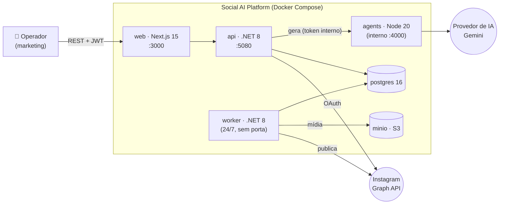
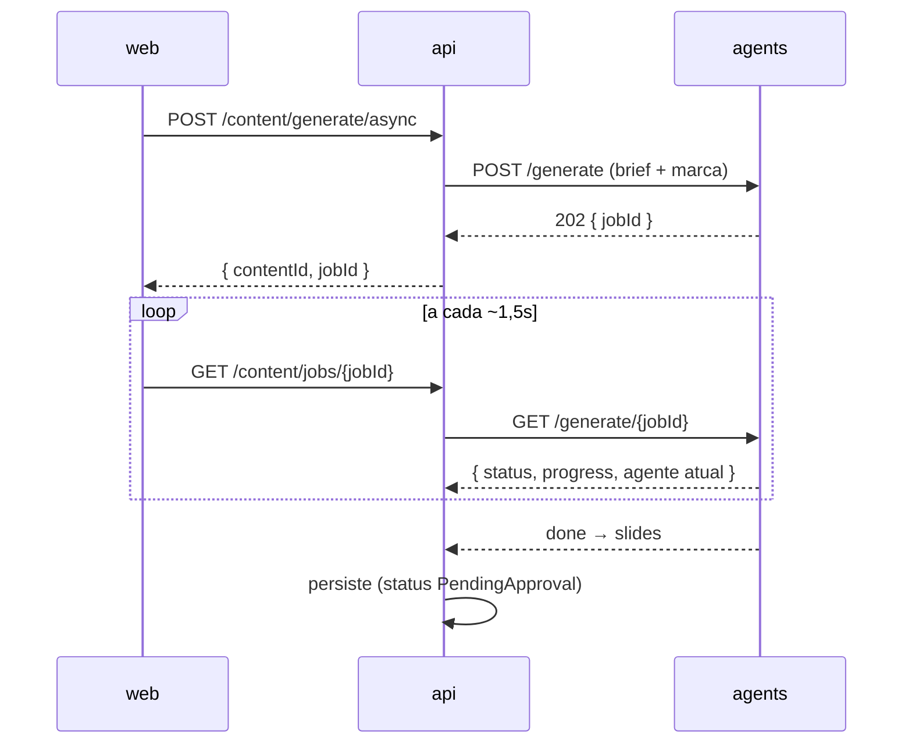
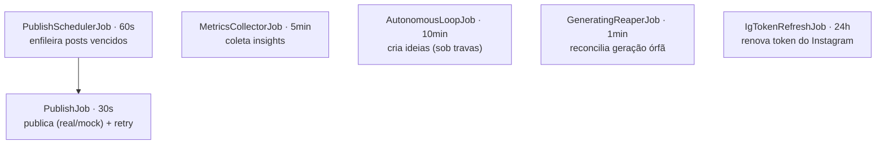

# Social AI Platform

Plataforma self-hosted que **gera, aprova, agenda e publica** conteúdo de Instagram de forma
autônoma, usando um pipeline de 6 agentes de IA — com um loop opcional que aprende com o desempenho
das publicações e propõe novas pautas quando a fila editorial esvazia.

> **Stack:** .NET 8 · Node 20 · Next.js 15 · PostgreSQL 16 · MinIO — orquestrados por Docker Compose.
> **Multi-tenant por design:** um deploy por cliente (single-tenant) ou vários workspaces num só deploy.

```
   Marca + Pauta ──▶ [gerar: 6 agentes] ──▶ [aprovar: humano] ──▶ [agendar] ──▶ [publicar]
                                                                                      │
                            [aprender] ◀── [coletar métricas] ◀───────────────────────┘
```

---

## Visão geral



| Serviço | Runtime | Responsabilidade | Fala com |
|---------|---------|------------------|----------|
| **web** | Next.js 15 (App Router) | Interface do operador: dashboard, marca, pautas, geração, aprovação, calendário, conexão Instagram. | api |
| **api** | .NET 8 Web API | Autenticação, multi-tenancy, CRUD, orquestração da geração, OAuth do Instagram. | postgres, agents, Instagram |
| **worker** | .NET 8 Worker | Tarefas 24/7: agendar → publicar → métricas → loop autônomo → renovar token. | postgres, minio, Instagram |
| **agents** | Node 20 + TS (Fastify) | Pipeline de geração (6 agentes). Serviço interno, sem porta pública; autenticado por token. | provedor de IA |
| **postgres** | PostgreSQL 16 | Persistência (EF Core) **e** fila de publicação (`PublishLog`). | — |
| **minio** | MinIO (S3) | Mídia em bucket privado; entrega URL pré-assinada à Graph API. | — |

> Detalhe completo da arquitetura (contexto, contêineres, componentes, decisões) em
> [`ARCHITECTURE.md`](ARCHITECTURE.md).

---

## Quickstart

```bash
cp .env.example .env          # preencha as credenciais (o arquivo é comentado)
docker compose up --build     # sobe os 6 serviços
```

| Serviço | URL local |
|---------|-----------|
| Web (interface) | http://localhost:3000 |
| API (Swagger, em dev) | http://localhost:5080/swagger |
| API health | http://localhost:5080/health |
| Console do MinIO | http://localhost:9001 |

Sem as chaves de IA/Meta, a plataforma **sobe em modo degradado**: infra, interface, autenticação e
CRUD funcionam; a geração e a publicação real ficam indisponíveis (a publicação cai no `MockPublisher`,
uma simulação completa de ponta a ponta). É um estado de primeira classe, não um erro.

Há um `Makefile` com um vocabulário único para .NET e Node — `make up`, `make test`, `make help`.
O fluxo de desenvolvimento por serviço está em [`CONTRIBUTING.md`](CONTRIBUTING.md).

---

## Como a geração funciona

O pipeline leva de 60 a 120 s, então a geração é **assíncrona** (dispara e consulta): a API devolve
um identificador na hora, e o front mostra o progresso real do trabalho até terminar.



### A lógica macro dos 6 agentes

Uma cadeia de ordem estrita: a saída tipada de cada agente é a entrada do próximo. Cinco usam IA;
**`image-generator` e `render-engine` são determinísticos** (sem LLM).

```mermaid
flowchart LR
    brief["brief + marca"] --> s1
    s1["1 · brand-strategist<br/>template + arco narrativo"] --> s2
    s2["2 · story-architect<br/>briefing slide a slide"] --> s3
    s3["3 · copywriter<br/>copy PT-BR"] --> s4
    s4["4 · visual-compositor<br/>layout 1080×1350"] --> s5
    s5["5 · image-generator<br/>imagem (det.)"] --> s6
    s6["6 · quality-validator<br/>checagens + voz (≥70)"] --> r
    r["render-engine<br/>HTML/CSS final (det.)"] --> out["slides prontos"]
```



Garantias do pipeline: o **copywriter falha** se um slide ficar sem título; o **image-generator
nunca devolve preto** (cai num gradiente iridescente fixo); o **quality-validator** rejeita abaixo de
70. Sem chave de IA, o pipeline falha com mensagem clara — o modo degradado é decisão de fora dele.
Detalhe por agente em [`docs/sot/03-fluxos.md`](docs/sot/03-fluxos.md#3-o-pipeline-dos-6-agentes-por-dentro).

---

## O backend (api + worker)

A **API** segue _feature-folder_ (`apps/api/Features/<Área>/`: controller + DTOs + serviços juntos).
As 19 áreas, por domínio:

| Domínio | Áreas |
|---------|-------|
| **Identidade & acesso** | `Auth` · `Settings` (workspace, membros, fuso) · `Audit` |
| **Conteúdo** | `Brand` / `Brands` · `Pautas` · `Content` · `Templates` · `References` |
| **Operação** | `Approval` · `Scheduling` · `Publishing` · `History` · `Instagram` |
| **Inteligência & custo** | `Learning` · `Ideas` · `Budgets` · `Usage` · `Notifications` |

O **worker** roda 6 tarefas periódicas sobre o mesmo banco (a fila de publicação é a tabela
`PublishLog`, não um broker):



> Endpoints, enums, jobs e migrations — referência exaustiva em
> [`docs/sot/06-referencia.md`](docs/sot/06-referencia.md).

## O front (web)

App Router com um grupo de rotas `(app)` cujo layout é um _guard_ de autenticação. Dados via
**React Query**; clientes de API separados por domínio (`lib/{brand,content,pautas,…}.ts`). As 23
telas, por jornada:

| Jornada | Telas |
|---------|-------|
| **Entrar** | `login` · `accept-invite` |
| **Configurar a marca** | `brand` · `settings/brands` |
| **Planejar & gerar** | `dashboard` · `pautas` · `create` (assistente com progresso real) |
| **Revisar & decidir** | `approvals` · `content/[id]` · `content/compare` |
| **Publicar & acompanhar** | `calendar` · `publishing` · `history` |
| **Aprender & evoluir** | `insights` · `ideas` |
| **Administrar** | `settings/{ai, approval, instagram, usage, users, workspace, audit, prompts}` |

> Como a camada web se estrutura e conversa com a API: ver a seção **Camada web** em
> [`ARCHITECTURE.md`](ARCHITECTURE.md).

---

## Multi-tenancy & modo de deploy

O isolamento entre clientes é a garantia central, imposta em **três camadas** (leitura, requisição,
escrita) — ver [`ARCHITECTURE.md`](ARCHITECTURE.md#41-isolamento-multi-tenant-três-camadas). O mesmo
código atende dois modos por configuração:

| Modo | Workspaces | Uso |
|------|-----------|-----|
| **single-tenant** | 1 | Um deploy dedicado por cliente (padrão). |
| **multi-tenant** | N | Vários workspaces num só deploy. |

**Princípios travados:** segredos cifrados em repouso (AES-GCM); teto de gasto mensal por workspace +
kill-switch global no loop; aprovação humana antes da primeira publicação automática.

---

## Build, testes e verificação

| Serviço | build | typecheck | testes |
|---------|-------|-----------|--------|
| **.NET** (api/worker/Core) | `dotnet build` | — | `dotnet test tests/SocialAi.Tests` → **246** |
| **agents** | `npm run build` | `npm run typecheck` | `npm test` → **237 + 2 ignorados** |
| **web** | `npm run build` | `npm run typecheck` | `npm test` → **177** · `npm run test:a11y` → **4 axe E2E** |

**Contratos determinísticos:**
```bash
node scripts/gen-enums.mjs --check          # enums .NET ↔ TS em sincronia (12 enums)
node scripts/export-templates.mjs --check   # 4 templates canônicos
node scripts/smoke-e2e.mjs                  # smoke ponta a ponta contra a API no ar
```

> **Invariantes cobertos por teste:** isolamento multi-tenant (3 camadas), idempotência de
> publicação, gate de aprovação humana, sincronia de enums, fail-fast de segredos em Production.

---

## Estado da publicação

A publicação real depende do **App Review da Meta** (semanas). Até lá, o `MockPublisher` cumpre o
fluxo de ponta a ponta; o _flip_ para o `InstagramGraphPublisher` é **configuração**
(`PUBLISHER_MODE=graph`), nunca código.

## Documentação

| Quero… | Onde |
|--------|------|
| **Arquitetura** (contexto, contêineres, componentes, decisões) | [`ARCHITECTURE.md`](ARCHITECTURE.md) |
| **Como contribuir** (setup, comandos, convenções) | [`CONTRIBUTING.md`](CONTRIBUTING.md) |
| Referência detalhada (fluxos, segurança, glossário, roadmap) | [`docs/sot/`](docs/sot/) |
| Estado por capacidade (entregue / parcial / roadmap) | [`docs/sot/09-roadmap.md`](docs/sot/09-roadmap.md) |
| Decisões de arquitetura por feature | [`docs/adr/`](docs/adr/) |
| Implantação, credenciais, modos de operação | [`docs/DEPLOYMENT.md`](docs/DEPLOYMENT.md) |
| Deploy no Render (1-clique) | [`render.yaml`](render.yaml) (produção) · [`render.demo.yaml`](render.demo.yaml) (demo free) — ver `DEPLOYMENT.md §2b` |
| Manual do operador (cliente) + matriz de aceite | [`docs/entrega-cliente/`](docs/entrega-cliente/) |
| Convenções de código e mapa da lógica não-óbvia | [`ARCHITECTURE.md`](ARCHITECTURE.md) |

---

*Social AI Platform — by AIdeasLab.*
