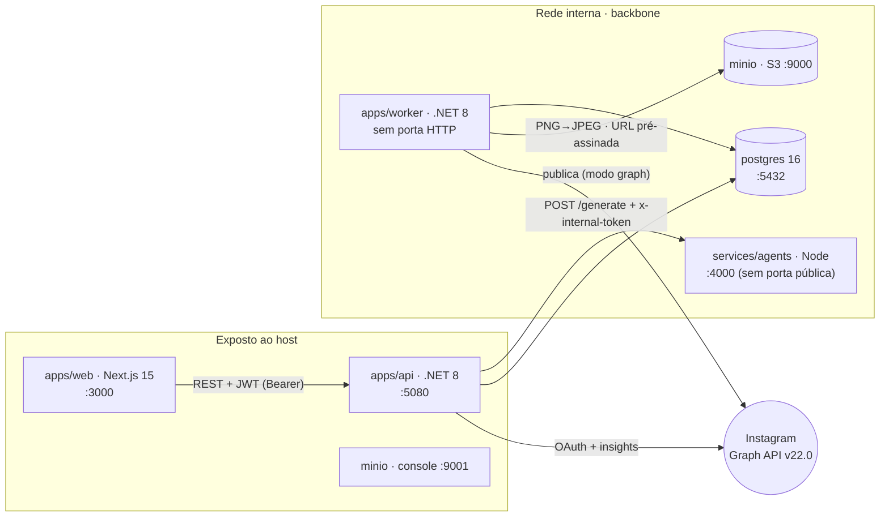

# 02 — Arquitetura

> **Quadrante Diátaxis: Explicação.**
> Mostra a topologia: quais serviços existem, qual o papel de cada um e como os dados fluem entre
> eles. Para as jornadas de uso ponta a ponta, ver [03 — Fluxos](03-fluxos.md). Termos linkam para o
> [glossário](08-glossario.md).

---

## 1. Monorepo em uma árvore

```
social-ai-platform/
├── apps/
│   ├── web/                  → interface do operador (Next.js 15)
│   ├── api/                  → API REST + autenticação + orquestração (.NET 8)
│   └── worker/               → tarefas 24/7 em segundo plano (.NET 8)
├── libs/
│   └── SocialAi.Core/        → biblioteca compartilhada (.NET, não-web):
│       ├── Domain/           → entidades + enums
│       ├── Data/             → AppDbContext, interceptor de tenant, migrations
│       ├── Infrastructure/   → cifra de segredos (SecretProtector)
│       └── Migrations/       → migrations do esquema do banco (EF Core)
├── services/
│   └── agents/               → pipeline de geração, 6 agentes (Node 20 + TypeScript)
├── packages/
│   └── design-tokens/        → tokens visuais APEX → Tailwind + variáveis CSS
├── tests/
│   └── SocialAi.Tests/       → rede de testes dos invariantes críticos (xUnit)
└── docker-compose.yml        → orquestra os 6 serviços
```
*Figura: estrutura de pastas do monorepo. Cada `app`/`service` é um runtime independente; `libs` e
`packages` são código compartilhado.*

## 2. Os serviços (tabela canônica)

| Caminho | Runtime | Papel | Porta (host) |
|---------|---------|-------|--------------|
| `apps/web` | Next.js 15 (App Router) | Interface do operador: painel, marca, pautas, geração, aprovação, calendário, conexão com Instagram. | `3000` |
| `apps/api` | .NET 8 Web API | API [REST](08-glossario.md#rest) + autenticação [JWT](08-glossario.md#jwt-json-web-token) + [multi-tenancy](08-glossario.md#multi-tenant-multilocatário); orquestra a geração; [OAuth](08-glossario.md#oauth) do Instagram. | `5080` |
| `apps/worker` | .NET 8 Worker | Tarefas 24/7: agendar → publicar → métricas → loop → [reaper](08-glossario.md#reaper-ceifador) → renovar token. Sem interface. | — (sem porta HTTP) |
| `libs/SocialAi.Core` | .NET 8 (lib não-web) | Domínio + dados + migrations + resolução de workspace + [cifra de segredos](08-glossario.md#aes-gcm), **compartilhados entre `api` e `worker`**. | — |
| `services/agents` | Node 20 + TypeScript (Fastify) | Pipeline assíncrono dos [6 agentes](08-glossario.md#agente-de-ia) (multi-provider: Gemini/OpenAI/Grok/Claude). [Serviço interno](08-glossario.md#serviço-de-agentes-agents). | `4000` (interno) |
| `packages/design-tokens` | Node (ESM) | Tokens visuais APEX → configuração do Tailwind + variáveis CSS. | — |
| `postgres` | PostgreSQL 16 | Persistência + fila de publicação ([PublishLog](08-glossario.md#publishlog-registro-de-publicação)). | `5432` |
| `minio` | MinIO (S3-compat) | Armazenamento de mídia (bucket privado + [URL pré-assinada](08-glossario.md#url-pré-assinada-presigned-url)). | `9000` / `9001` (console) |

> **6 serviços no Docker Compose:** `web`, `api`, `worker`, `agents`, `postgres`, `minio`.
> Não há Redis nem Hangfire — a fila de publicação é a tabela
> [PublishLog](08-glossario.md#publishlog-registro-de-publicação) no PostgreSQL, e o registro de
> trabalhos dos agentes é em memória (por decisão). Definido em `docker-compose.yml`.

## 3. Mapa de comunicação


*Figura: quem fala com quem. A API é a única porta de entrada autenticada; ela alcança os
[agentes](08-glossario.md#serviço-de-agentes-agents) apenas pela rede interna. O
[worker](08-glossario.md#worker-serviço-de-segundo-plano) compartilha o banco da API e publica via
MinIO + [Graph API](08-glossario.md#graph-api).*

### Fluxo de dados em texto

1. `web ──REST/JWT──▶ api ──▶ postgres` — toda interação do operador passa pela API, autenticada por
   [JWT](08-glossario.md#jwt-json-web-token), e persiste no PostgreSQL.
2. `api ──POST /generate (x-internal-token)──▶ agents` — a geração é delegada ao serviço de agentes
   pela rede interna; a API depois faz [poll](08-glossario.md#poll-polling) do progresso.
3. `worker ──▶ postgres` (mesmo banco, via `SocialAi.Core`); `worker ──MinIO + Graph API──▶ Instagram`
   — o worker lê a fila, prepara a mídia e publica.

## 4. Por que a biblioteca compartilhada (`SocialAi.Core`)

O domínio (entidades, enums), o acesso a dados (`AppDbContext`, o
[interceptor de tenant](07-seguranca.md), as [migrations](08-glossario.md#migration)), a resolução de
workspace e a [cifra de segredos](08-glossario.md#aes-gcm) vivem em `libs/SocialAi.Core` porque
**tanto a API quanto o worker precisam deles**. Consequências práticas:

- Uma mudança em uma entidade ou no `AppDbContext` afeta os dois serviços — recompile ambos.
- O worker roda sobre a imagem menor `dotnet/runtime` (não precisa do SDK web), pois não referencia a
  API — apenas a `Core`.
- Por compatibilidade, os tipos mantêm os namespaces `SocialAi.Api.*` mesmo morando na `Core`, para
  não quebrar migrations e consumidores.

## 5. A fila de publicação é o banco, não Redis

```
  ScheduledPost (agendado)
        │  PublishSchedulerJob (60s) marca Dispatched e cria…
        ▼
  PublishLog { Result = Pending }      ◀── ESTA é a "fila"
        │  PublishJob (30s) consome, publica e atualiza…
        ▼
  PublishLog { Result = Success | Error | Skipped }
```
*Figura: o ciclo de vida de uma publicação é uma transição de estado em linhas do PostgreSQL. Sem
broker de mensagens externo. Detalhes em [03 — Fluxos](03-fluxos.md).*

## 6. Decisões de arquitetura travadas

Estas decisões não devem ser reabertas sem motivo:

| Decisão | O que significa |
|---------|-----------------|
| **Estética APEX** | Identidade visual própria (canvas/ink/Satoshi), não o tema padrão indigo. |
| **Progresso de agente real** | A barra de progresso da geração reflete o estado real do [job](08-glossario.md#job-trabalho) (via [poll](08-glossario.md#poll-polling)), nunca uma simulação. |
| **Segredos com `.env` + AES-GCM** | Credenciais no `.env` (no host) e cifradas em repouso no banco; um deploy por cliente. |
| **Segurança do loop** | Teto de gasto mensal por workspace + [chave geral](08-glossario.md#kill-switch-chave-geral); ideias do loop exigem aprovação humana antes da primeira publicação. |

## 7. Mapa rápido da lógica não-óbvia

| Assunto | Arquivo |
|---------|---------|
| Filtro de leitura por tenant | `libs/SocialAi.Core/Data/AppDbContext.cs` |
| Guarda de escrita por tenant (sync+async) | `libs/SocialAi.Core/Data/TenantSaveInterceptor.cs` |
| Resolução de workspace (API / worker) | `apps/api/Infrastructure/CurrentWorkspace.cs`, `apps/worker/SystemWorkspace.cs` |
| Boot + fail-fast de segredos (API) | `apps/api/Program.cs` |
| Boot + validação da URL pública (worker) | `apps/worker/Program.cs` |
| Cifra de segredos (AES-GCM) | `libs/SocialAi.Core/Infrastructure/SecretProtector.cs` |
| OAuth do Instagram (anti-CSRF) | `apps/api/Features/Instagram/InstagramAuthController.cs` |
| Contrato de geração (assíncrono) | `apps/api/Features/Content/{ContentController,AgentsClient}.cs` |
| Orquestrador do pipeline | `services/agents/src/agents/pipeline-v2.ts` |
| Seleção mock/graph + publicação | `apps/worker/Publishing/Publishers.cs` |
| Mídia PNG→JPEG→URL pré-assinada | `apps/worker/Publishing/MediaService.cs` |
| Travas do loop autônomo | `apps/worker/Jobs/AutonomousLoopJob.cs` |

Para o detalhamento por assunto (variáveis, rotas, enums, jobs, migrations), ver
[06 — Referência](06-referencia.md).

---

*Quadrante: Explicação. Fontes: `docker-compose.yml`, `apps/`, `libs/SocialAi.Core`,
`services/agents`. Sincronize com o código a cada mudança estrutural.*
