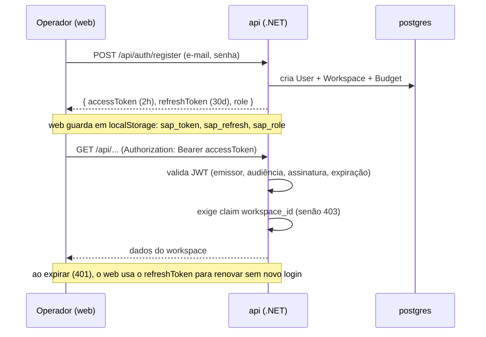
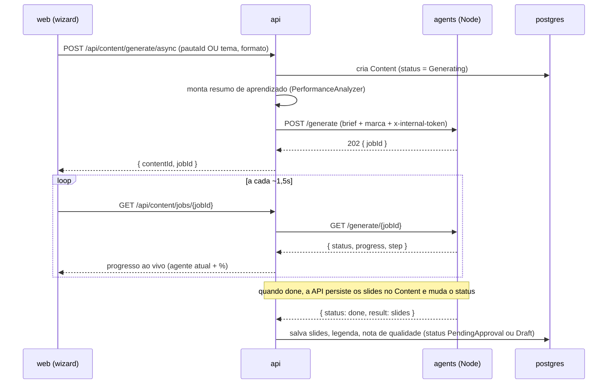
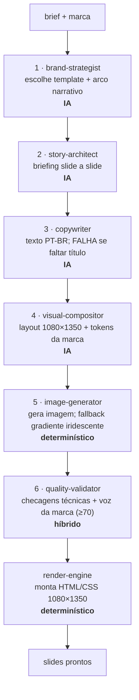
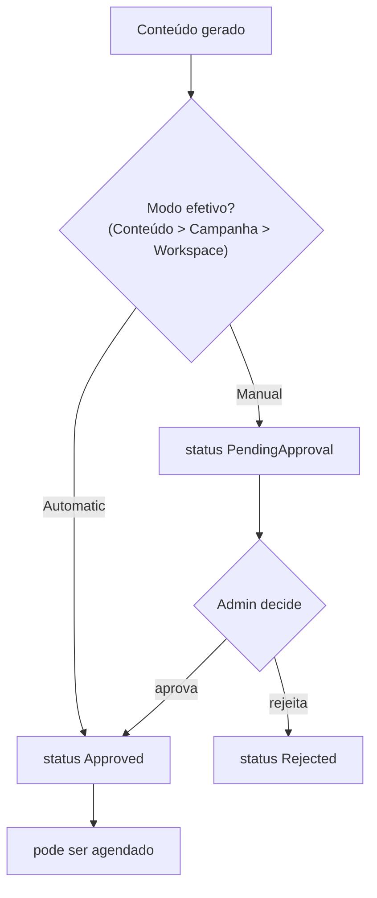
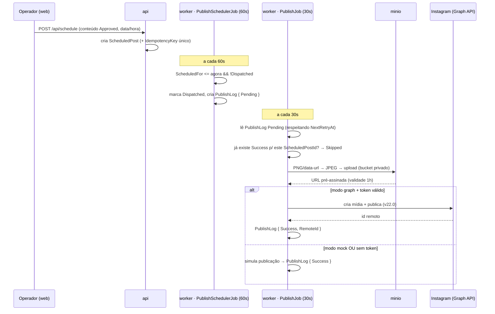
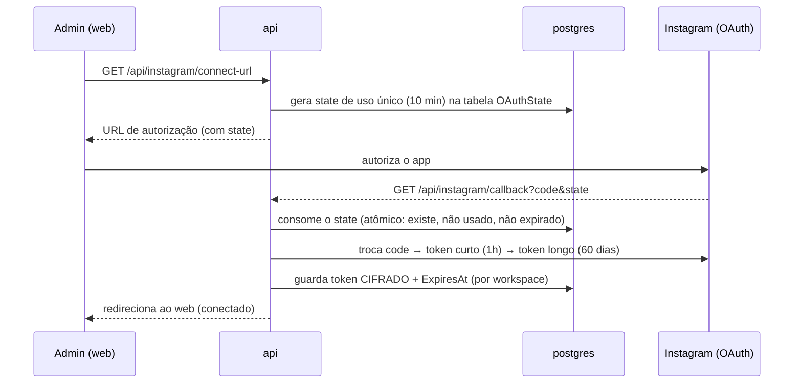
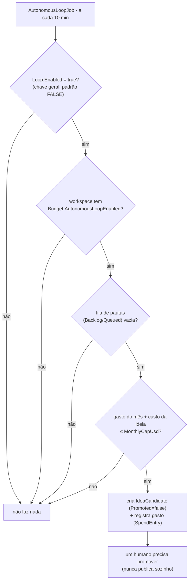

# 03 — Fluxos Ponta a Ponta

> Descreve as jornadas completas do sistema com diagramas de sequência: geração, aprovação,
> agendamento, publicação, conexão com Instagram, loop autônomo e modo degradado. Para a estrutura
> estática, ver [02 — Arquitetura](02-arquitetura.md). Termos linkam para o
> [glossário](08-glossario.md).

---

## Índice de fluxos

1. [Autenticação e sessão](#1-autenticação-e-sessão)
2. [Geração de conteúdo (assíncrona)](#2-geração-de-conteúdo-assíncrona)
3. [O pipeline dos 6 agentes (por dentro)](#3-o-pipeline-dos-6-agentes-por-dentro)
4. [Aprovação e modo de aprovação](#4-aprovação-e-modo-de-aprovação)
5. [Agendamento e publicação](#5-agendamento-e-publicação)
6. [Conexão com o Instagram (OAuth)](#6-conexão-com-o-instagram-oauth)
7. [Loop autônomo](#7-loop-autônomo)
8. [Modo degradado](#8-modo-degradado)

---

## 1. Autenticação e sessão

O primeiro usuário a se registrar cria o [workspace](08-glossario.md#workspace-espaço-de-trabalho) e
vira `Admin`. A sessão usa [JWT](08-glossario.md#jwt-json-web-token) de acesso (2 horas) renovado silenciosamente
por um [refresh token](08-glossario.md#refresh-token) (30 dias).


*Figura: registro, requisição autenticada e renovação silenciosa. O claim
[`workspace_id`](08-glossario.md#claim-do-jwt) é exigido em toda requisição autenticada — a base do
[isolamento multi-tenant](07-seguranca.md). Fonte: `apps/api/Features/Auth/`,
`apps/web/lib/api.ts`.*

- **Proteção contra força bruta:** os endpoints de autenticação têm limite de **10 requisições por
  minuto por IP** (`apps/api/Program.cs`).
- **401 → logout global:** quando a renovação falha, o front-end limpa a sessão e redireciona para o
  login (`apps/web/lib/api.ts`).

## 2. Geração de conteúdo (assíncrona)

O pipeline leva de 60 a 120 segundos — tempo demais para uma requisição síncrona. Por isso a geração
é [fire-and-forget + poll](08-glossario.md#fire-and-forget-dispara-e-segue): a API devolve
identificadores imediatamente e o front-end consulta o progresso até terminar.


*Figura: contrato assíncrono entre web, API e agentes. O progresso exibido é real (vem do
[job](08-glossario.md#job-trabalho)), nunca simulado. Fonte: `apps/web/app/(app)/create/page.tsx`,
`apps/api/Features/Content/{ContentController,AgentsClient}.cs`, `services/agents/src/server.ts`.*

> **Antes de chamar os agentes**, a API injeta um **resumo de aprendizado**
> (`apps/api/Features/Learning/PerformanceAnalyzer.cs`) construído a partir das métricas passadas
> (melhor formato, melhor janela de postagem) — é assim que o desempenho das publicações
> realimenta a geração.

**Tolerância a falha (geração órfã):** se o serviço de agentes reiniciar, o
[job](08-glossario.md#job-trabalho) em memória se perde e o conteúdo ficaria preso em `Generating`.
O [reaper](08-glossario.md#reaper-ceifador) (`GeneratingReaperJob`, a cada 1 min) marca como `Failed`
todo conteúdo preso há mais de 10 minutos (`apps/worker/Jobs/GeneratingReaperJob.cs`).

## 3. O pipeline dos 6 agentes (por dentro)

Ordem estrita: a saída tipada de cada [agente](08-glossario.md#agente-de-ia) é a entrada do próximo
(`services/agents/src/agents/pipeline-v2.ts`).


*Figura: os 6 agentes em ordem, com indicação de quais usam Inteligência Artificial. O
`render-engine` e o `image-generator` são determinísticos (sem IA). Fonte:
`services/agents/src/agents/*.ts`.*

Pontos não-óbvios, todos verificados no código:

- **`copywriter` falha duro** se qualquer slide ficar sem título (headline) — não há texto silenciosamente
  vazio (`services/agents/src/agents/copywriter.ts`).
- **`image-generator` nunca devolve preto:** se a geração de imagem falhar, ele cai num **gradiente
  iridescente fixo**, não numa tela preta (`services/agents/src/agents/image-generator.ts`).
- **`quality-validator`** dá uma [nota de 0 a 100](08-glossario.md#quality-score-nota-de-qualidade);
  abaixo de 70 o resultado é rejeitado. As checagens técnicas são determinísticas; a checagem de "voz"
  da marca usa IA.
- **Sem chave de IA = falha clara, não modo degradado interno:** dentro do pipeline, a ausência de
  `AI_PROVIDER_KEY` é uma falha dura com mensagem explícita — o [modo degradado](#8-modo-degradado) é
  uma decisão de fora do pipeline (`services/agents/src/jobs.ts`).
- **Provedor de IA trocável** por `TEXT_PROVIDER`/`IMAGE_PROVIDER` (ou pela UI, por workspace):
  texto via Gemini/OpenAI/Grok/Claude, imagem via Gemini/OpenAI
  (`services/agents/src/text/textProvider.ts`, `image/imageProvider.ts`; ver `10-multi-provider.md`).

## 4. Aprovação e modo de aprovação

Por padrão, nada é agendado sem aprovação humana. O
[modo de aprovação](08-glossario.md#modo-de-aprovação-approvalmode) efetivo é resolvido por
precedência **Conteúdo > Campanha > Workspace**.


*Figura: o gate de moderação. Em modo `Manual`, um `Admin` precisa aprovar; em `Automatic`, o
conteúdo já nasce apto a agendar. Fonte: `apps/api/Features/Approval/`.*

- A decisão (`POST /api/approval/content/{id}/decide`) só é aceita se o conteúdo estiver em `Draft` ou
  `PendingApproval` — não se pode "re-decidir" o que já avançou.
- Só usuários `Admin` mudam modos de aprovação (workspace, campanha, conteúdo) e decidem aprovações.

## 5. Agendamento e publicação

A publicação é um pipeline de duas tarefas no [worker](08-glossario.md#worker-serviço-de-segundo-plano),
usando a tabela [PublishLog](08-glossario.md#publishlog-registro-de-publicação) como fila.


*Figura: do agendamento à publicação. O agendador apenas enfileira; quem publica é o `PublishJob`. A
escolha entre publicação real e simulada acontece em tempo de execução. Fonte:
`apps/worker/Jobs/{PublishSchedulerJob,PublishJob}.cs`, `apps/worker/Publishing/{Publishers,MediaService}.cs`.*

### Garantias da publicação

- **Idempotência** (publicar uma única vez): cada `ScheduledPost` tem uma
  [chave de idempotência](08-glossario.md#idempotência) única (índice no banco); o `PublishJob`
  ainda verifica se já existe um `PublishLog` com `Success` para aquele post antes de publicar de
  novo. Protege contra publicação dupla em reinício do worker.
- **Retry com backoff:** falhas transitórias mantêm o `PublishLog` como `Pending`, incrementam o
  contador de tentativas e adiam a próxima (`NextRetryAt = agora + 2^tentativas` minutos, teto de
  30 min, até ~5 tentativas). Falha permanente ou esgotamento → `Error`.
- **Mídia para a Graph API:** o Instagram **baixa** a imagem da URL que recebe, então o bucket fica
  privado e o worker entrega uma [URL pré-assinada](08-glossario.md#url-pré-assinada-presigned-url)
  temporária. Em [modo graph](08-glossario.md#graph-modo-graph), `MINIO_PUBLIC_BASE_URL` precisa
  apontar para um host alcançável pela internet — ver [05 — Operação](05-operacao.md).

### Quando é real e quando é simulado

A seleção do publicador (`apps/worker/Publishing/Publishers.cs`) usa o publicador **real**
(`InstagramGraphPublisher`) somente quando **`Publisher:Mode` é diferente de `mock`** **e** existe um
token de Instagram não expirado para o workspace. Caso contrário usa o
[`MockPublisher`](08-glossario.md#mock-modo-mock). Antes de postar de verdade, o publicador real
ainda checa o limite de publicações da conta (`content_publishing_limit`) na Graph API.

## 6. Conexão com o Instagram (OAuth)


*Figura: conexão da conta. O parâmetro `state` de uso único protege contra
[CSRF](08-glossario.md#csrf-cross-site-request-forgery); o token é guardado
[cifrado](08-glossario.md#aes-gcm). Fonte: `apps/api/Features/Instagram/InstagramAuthController.cs`.*

- O token longo (60 dias) é renovado proativamente pelo worker antes de vencer
  (`IgTokenRefreshJob`, ver [05 — Operação](05-operacao.md)).
- O valor do token nunca é devolvido por nenhuma consulta de leitura; a interface mostra apenas se
  está conectado, o usuário e a data de expiração.

## 7. Loop autônomo

O [loop autônomo](08-glossario.md#loop-autônomo) inventa [pautas](08-glossario.md#pauta) quando a
fila editorial esvazia — mas só depois de passar por uma sequência de travas. **Vem desligado por
padrão.**


*Figura: as quatro travas do loop, em ordem. Pautas humanas sempre vencem (o loop só age com a fila
vazia). Fonte: `apps/worker/Jobs/AutonomousLoopJob.cs`.*

> **Segurança do loop (invariante):** o loop nunca publica automaticamente. Ele cria
> [IdeaCandidates](08-glossario.md#ideacandidate-candidato-a-ideia) com `Promoted=false`; um humano os
> promove a pauta pela tela **Ideias** (`/ideas` → `POST /api/ideas/{id}/promote`). A *geração* da
> ideia é hoje um rascunho de texto fixo (ainda não usa IA) — ver [09 — Roadmap](09-roadmap.md).

## 8. Modo degradado

O [modo degradado](08-glossario.md#modo-degradado) é o que acontece quando faltam as chaves de IA
(`AI_PROVIDER_KEY`) ou do Instagram (`META_*`). **Não é um defeito — é um estado de primeira classe.**

```
  SEM chaves de IA / Meta              COM chaves
  ─────────────────────────           ─────────────────────────
  ✅ infra sobe (6 serviços)          ✅ tudo do modo degradado +
  ✅ cadastro / login / sessão        ✅ geração real (pipeline 6 agentes)
  ✅ marca / pautas / CRUD            ✅ publicação real (se modo graph)
  ✅ aprovação / agendamento          ✅ conexão real com Instagram
  ✅ publicação SIMULADA (mock)
  ❌ geração real (falha clara)
  ❌ publicação real
```
*Figura: o que funciona com e sem credenciais. A publicação simulada
([mock](08-glossario.md#mock-modo-mock)) cobre o fluxo ponta a ponta mesmo sem a Meta. Fonte:
`apps/worker/Publishing/Publishers.cs`, `services/agents/src/jobs.ts`.*

A passagem de simulado para real é **só configuração** (`PUBLISHER_MODE=graph` + conta conectada +
URL pública do MinIO), nunca código. Ver [05 — Operação](05-operacao.md).

---

*Cada fluxo foi conferido contra o código citado. Para os fatos tabelados
(rotas, enums, jobs), ver [06 — Referência](06-referencia.md).*
