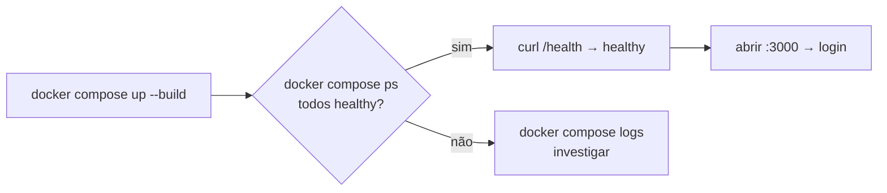

# 04 — Instalação

> Um caminho do zero até a plataforma rodando e verificada. Siga os passos em ordem. Para tarefas
> operacionais pontuais depois disto, ver [05 — Operação](05-operacao.md). Termos linkam para o
> [glossário](08-glossario.md).

---

## O que você terá ao final

Os 6 serviços rodando localmente em [modo degradado](08-glossario.md#modo-degradado) (sem chaves de
IA/Meta), com a interface acessível e os testes passando. A partir daí, adicionar credenciais
"liga" a geração e a publicação real.

## Pré-requisitos

| Ferramenta | Para quê | Como checar |
|------------|----------|-------------|
| **Docker** + **Docker Compose** | Subir os 6 serviços | `docker --version && docker compose version` |
| **Git** | Clonar o repositório | `git --version` |
| **.NET SDK 8** *(opcional)* | Rodar API/worker/testes sem Docker | `dotnet --version` |
| **Node 20** *(opcional)* | Rodar `agents`/`web` sem Docker | `node --version` |

> Para o caminho canônico (tudo em Docker), só **Docker** e **Git** são necessários. .NET e Node só
> entram no fluxo "por serviço" (passo 6) e na verificação local.

## Passo 1 — Clonar e criar o `.env`

```bash
git clone <repo> && cd social-ai-platform
cp .env.example .env
```

O arquivo `.env` é **ignorado pelo Git** (nunca comite segredos). O `.env.example` é o modelo
comentado com todas as variáveis. A referência completa de cada uma está em
[06 — Referência](06-referencia.md).

## Passo 2 — Preencher o mínimo

Para subir em [modo degradado](08-glossario.md#modo-degradado), só os valores de infraestrutura
precisam estar preenchidos (já vêm com defaults no `.env.example`). Confirme/ajuste:

```bash
POSTGRES_USER=social
POSTGRES_PASSWORD=troque-esta-senha
POSTGRES_DB=social_ai
MINIO_ROOT_USER=minioadmin
MINIO_ROOT_PASSWORD=troque-esta-senha-minio
```

Deixe as chaves de IA/Meta vazias por enquanto:

```bash
AI_PROVIDER_KEY=          # vazio = sem geração real (modo degradado)
META_APP_ID=              # vazio = sem publicação real
META_APP_SECRET=
PUBLISHER_MODE=mock       # publicação simulada (padrão)
```

> **Para desenvolvimento**, deixe `ASPNETCORE_ENVIRONMENT=Development` e
> `DOTNET_ENVIRONMENT=Development` (padrão). Em **entrega real** isso muda para `Production` — ver
> [05 — Operação](05-operacao.md) (a API recusa subir sem segredos fortes em Production).

## Passo 3 — Subir os 6 serviços

```bash
docker compose up --build -d
```

Isto constrói e sobe `web`, `api`, `worker`, `agents`, `postgres` e `minio`. **As
[migrations](08-glossario.md#migration) do banco são aplicadas automaticamente no boot da API** —
não há passo manual (a API tenta novamente enquanto o PostgreSQL termina de subir).

Acompanhe a saúde:

```bash
docker compose ps          # aguarde os healthchecks (postgres, minio, api, agents)
docker compose logs -f api # logs da API (deve registrar "Migrations aplicadas.")
```

## Passo 4 — Verificar que está no ar

| Verificação | Comando / URL | Resultado esperado |
|-------------|---------------|--------------------|
| Saúde da API | `curl http://localhost:5080/health` | `{"status":"healthy","service":"api",...}` |
| Interface web | abrir http://localhost:3000 | tela de login |
| Documentação da API (dev) | abrir http://localhost:5080/swagger | Swagger UI (só em `Development`) |
| Console do MinIO | abrir http://localhost:9001 | login do MinIO |


*Figura: o caminho de verificação após subir. Se um serviço não fica `healthy`, os logs daquele
serviço dizem por quê.*

## Passo 5 — Primeiro uso (configuração inicial)

1. **Registrar** o operador em http://localhost:3000 — o primeiro usuário cria o
   [workspace](08-glossario.md#workspace-espaço-de-trabalho) e vira `Admin`.
2. **Marca** (`/brand`): tom de voz, diretrizes, concorrentes, referências visuais.
3. **Pautas** (`/pautas`): alimentar o backlog editorial com prioridade.
4. **Gerar** (`/create`): selecionar uma pauta + formato. *(Requer `AI_PROVIDER_KEY`; sem ela, a
   geração falha com mensagem clara — comportamento esperado no modo degradado.)*
5. **Aprovar** (`/approvals`) e **agendar** (`/calendar`).

Para detalhar credenciais e o fluxo de publicação real, siga para [05 — Operação](05-operacao.md).

## Passo 6 *(alternativo)* — Desenvolvimento por serviço

Para iterar em um serviço nativamente, suba só a infraestrutura no Docker e rode o serviço local:

```bash
docker compose up postgres minio -d              # só as dependências

cd apps/api    && dotnet run                      # API em :5080 (Swagger em /swagger)
cd apps/worker && dotnet run                      # tarefas de segundo plano
cd services/agents && npm install && npm run dev  # agents (tsx watch) em :4000
cd apps/web    && npm install && npm run dev      # web (Next.js) em :3000
```

## Passo 7 — Verificação local (sem Docker)

Estes comandos validam o código sem precisar do Docker e devem passar antes de qualquer entrega:

```bash
# .NET — compila Core + API + Worker (a partir do projeto do worker, que referencia a Core)
dotnet build apps/worker/Worker.csproj

# Suíte de testes .NET (sem banco externo — usa SQLite em memória)
dotnet test tests/SocialAi.Tests/SocialAi.Tests.csproj      # esperado: 246/246

# Agents (Node) — checagem de tipos + build (o build precisa de tsc-alias, não só tsc)
cd services/agents && npm run typecheck && npm run build

# Web (Next.js) — checagem de tipos
cd apps/web && npm run typecheck
```

> **O que a suíte cobre:** entre os 246 testes .NET, o núcleo de
> [invariantes](08-glossario.md#multi-tenant-multilocatário) críticos verifica o isolamento
> multi-tenant (`InvariantTests.cs`) e o [fail-fast de segredos](08-glossario.md#fail-fast-de-segredos)
> em Production (`SecretFailFastTests.cs`); o restante cobre os contratos das features (auth, marca,
> geração, agendamento, publicação), usando [xUnit](08-glossario.md#xunit) + SQLite em memória.

## Problemas comuns

| Sintoma | Causa provável | Ação |
|---------|----------------|------|
| API não fica `healthy` | PostgreSQL ainda subindo / migrations falhando | `docker compose logs api`; a API tenta migrar 10× com 3s de intervalo. |
| Imagem `.NET` não baixa | `mcr.microsoft.com` indisponível | O build local (`dotnet build`) ainda funciona; só o empacotamento Docker de api/worker fica bloqueado. |
| Geração falha mesmo com tudo no ar | `AI_PROVIDER_KEY` vazia | Esperado em modo degradado. Adicione a chave (ver [05 — Operação](05-operacao.md)). |
| Mudei `NEXT_PUBLIC_API_URL` e a web não pegou | É variável de **build-time** | `docker compose build web && docker compose up -d web` (ver [05 — Operação](05-operacao.md)). |

---

*Comandos conferidos contra `docker-compose.yml`,
`services/agents/package.json` e `tests/SocialAi.Tests`.*
