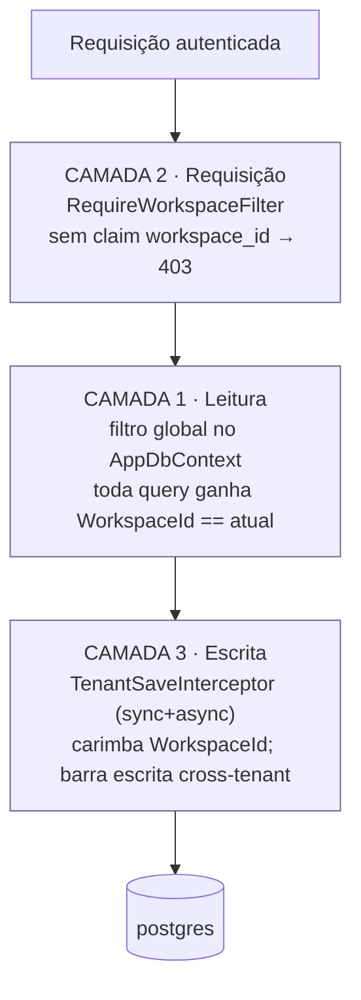

# 07 — Segurança

> Modelo de ameaças, isolamento [multi-tenant](08-glossario.md#multi-tenant-multilocatário), gestão
> de [segredos](08-glossario.md#segredo-secret) e decisões de trade-off. Índice navegável; cada
> defesa cita o arquivo onde vive. Termos linkam para o [glossário](08-glossario.md).

---

## Índice

1. [Modelo de ameaças (resumo)](#1-modelo-de-ameaças-resumo)
2. [Isolamento multi-tenant — as 3 camadas](#2-isolamento-multi-tenant--as-3-camadas)
3. [Autenticação e sessão](#3-autenticação-e-sessão)
4. [Segredos em repouso](#4-segredos-em-repouso)
5. [Conexão com o Instagram (OAuth)](#5-conexão-com-o-instagram-oauth)
6. [Confiança de rede interna](#6-confiança-de-rede-interna)
7. [Endurecimento de produção](#7-endurecimento-de-produção)
8. [Decisões de trade-off](#8-decisões-de-trade-off)

---

## 1. Modelo de ameaças (resumo)

| Ameaça | Defesa | Onde |
|--------|--------|------|
| Um cliente acessar dados de outro | Isolamento [multi-tenant](08-glossario.md#multi-tenant-multilocatário) em 3 camadas | §2 |
| Token de sessão forjado | [JWT](08-glossario.md#jwt-json-web-token) assinado (HMAC-SHA256) com emissor/audiência validados | §3 |
| Força bruta / *credential stuffing* | Limite de 10 req/min por IP nos endpoints de auth | §3 |
| Vazamento de credenciais do banco | Segredos [cifrados](08-glossario.md#aes-gcm) em repouso (AES-GCM) | §4 |
| Sequestro do fluxo de OAuth ([CSRF](08-glossario.md#csrf-cross-site-request-forgery)) | Parâmetro `state` de uso único, com expiração | §5 |
| Terceiro disparar o pipeline de IA e queimar orçamento | Serviço de agentes sem porta pública + `x-internal-token` | §6 |
| Subir em produção com segredo fraco | [Fail-fast](08-glossario.md#fail-fast-de-segredos) de boot | §7 |
| Vazamento de detalhe interno em erros | Stack trace suprimido em produção | §7 |

## 2. Isolamento multi-tenant — as 3 camadas

Toda tabela isolável carrega um [`WorkspaceId`](08-glossario.md#workspaceid) (via a base
`TenantEntity`). O isolamento é imposto em **três lugares**; mexer em um exige entender os outros
dois.

*Figura: uma requisição atravessa as três camadas antes de tocar o banco. Fontes:
`apps/api/Infrastructure/TenantFilter.cs`, `libs/SocialAi.Core/Data/AppDbContext.cs`,
`libs/SocialAi.Core/Data/TenantSaveInterceptor.cs`.*

1. **Leitura** — um filtro global de consulta no `AppDbContext` (`OnModelCreating`) acrescenta
   `WorkspaceId == workspace atual` a toda consulta de entidade isolável. É **desativado quando o
   workspace atual é `null`** (caso do worker e das migrations).
2. **Requisição** — `RequireWorkspaceFilter` (registrado globalmente em `apps/api/Program.cs`)
   rejeita com **403** qualquer requisição autenticada sem um claim
   [`workspace_id`](08-glossario.md#claim-do-jwt) válido.
3. **Escrita** — o `TenantSaveInterceptor` cobre **tanto** `SaveChanges` **quanto**
   `SaveChangesAsync`: carimba o `WorkspaceId` em inserções e **lança exceção** em qualquer
   inserção/atualização/remoção cross-tenant.

> **O worker é uma exceção deliberada:** ele resolve o workspace como `null`
> (`apps/worker/SystemWorkspace.cs`) para desligar o filtro de leitura e processar todos os
> workspaces em uma só consulta. A isolação, nesse caso, vive nos **predicados `WorkspaceId`
> explícitos** dentro de cada job. O `DesignTimeDbContextFactory` também usa `null` para as
> migrations rodarem sem contexto de tenant.

Estes invariantes são cobertos por testes automatizados (`tests/SocialAi.Tests/InvariantTests.cs`).

## 3. Autenticação e sessão

- **Emissão do [JWT](08-glossario.md#jwt-json-web-token)** (`apps/api/Features/Auth/TokenService.cs`): token de
  acesso de **2 horas**, assinado com `Jwt:Secret` (HMAC-SHA256), carregando os
  [claims](08-glossario.md#claim-do-jwt) `sub`, `email`, `role` e
  [`workspace_id`](08-glossario.md#claim-do-jwt).
- **Validação** (`apps/api/Program.cs`): emissor **e audiência** validados (defesa em profundidade),
  com tolerância de relógio reduzida para 30 segundos.
- **[Refresh token](08-glossario.md#refresh-token)** de **30 dias**: renova a sessão sem novo login;
  guardado no navegador, mas **só o seu hash** é persistido no servidor; rotaciona a cada uso.
- **Limite de taxa** nos endpoints de auth (login/registro/refresh): **10 requisições por minuto por
  IP** (`apps/api/Program.cs`), respondendo `429` ao exceder.
- **Papéis**: `Member` e `Admin`. O 1º usuário do registro vira `Admin`. Ações sensíveis (modos de
  aprovação, configuração do app Meta, gerar URL de conexão) são restritas a `Admin`.

## 4. Segredos em repouso

`libs/SocialAi.Core/Infrastructure/SecretProtector.cs` cifra os
[segredos](08-glossario.md#segredo-secret) com **[AES-GCM](08-glossario.md#aes-gcm)** (a chave é o
SHA-256 de `Secrets:EncryptionKey`, com fallback para `Jwt:Secret` fora de produção). O valor é
guardado em base64 no formato `nonce|tag|ciphertext` na tabela `Secret`.

Quatro tipos de segredo são cifrados (`SecretKind`): token do Instagram, chave do provedor de IA,
chave do provedor de imagem e segredo do app Meta. **Nenhum valor de segredo é devolvido por
consulta de leitura** — a interface só recebe metadados (ex.: se o app Meta está configurado e o
`AppId`, nunca o segredo).

> **Trade-off de chave única:** trocar `SECRETS_ENCRYPTION_KEY` após o primeiro deploy invalida todos
> os segredos já cifrados. Por isso ela deve ser definida antes da entrega (ver
> [05 — Operação](05-operacao.md)).

## 5. Conexão com o Instagram (OAuth)

`apps/api/Features/Instagram/InstagramAuthController.cs` implementa
[OAuth](08-glossario.md#oauth) com **Instagram Login** (`graph.instagram.com`):

- **Anti-[CSRF](08-glossario.md#csrf-cross-site-request-forgery):** cada início de conexão gera um
  `state` aleatório de **uso único**, com validade de **10 minutos**, guardado na tabela `OAuthState`
  (migration `AddOAuthState`). No callback, o `state` é consumido de forma atômica (precisa existir,
  não ter sido usado e não ter expirado).
- **Troca de token:** `code` → token de curta duração (1 h) → token de longa duração (60 dias).
- **Persistência:** o token é guardado [cifrado](08-glossario.md#aes-gcm), por workspace, com a data
  de expiração. A renovação proativa é feita pelo worker (`IgTokenRefreshJob`).

## 6. Confiança de rede interna

- O [serviço de agentes](08-glossario.md#serviço-de-agentes-agents) **não tem porta publicada** no
  host (`docker-compose.yml`); só a API o alcança pela rede interna `backbone`.
- As chamadas API → agentes são autenticadas por um cabeçalho `x-internal-token`
  (`AGENTS_INTERNAL_TOKEN`). Quando a variável está **definida**, o agents **exige** a
  correspondência; quando **vazia** (desenvolvimento), aceita com um aviso no log
  (`services/agents/src/server.ts`). Em produção, defina-a para impedir que terceiros disparem o
  pipeline e consumam o orçamento de IA.

## 7. Endurecimento de produção

Ativado por `ASPNETCORE_ENVIRONMENT=Production` (API) e `DOTNET_ENVIRONMENT=Production` (worker):

| Endurecimento | Efeito | Onde |
|---------------|--------|------|
| [Fail-fast](08-glossario.md#fail-fast-de-segredos) de segredos | API recusa subir com `JWT_SECRET`/`SECRETS_ENCRYPTION_KEY` ausente, default ou < 32 bytes. | `apps/api/Program.cs` |
| Validação da URL pública | Worker recusa subir em `PUBLISHER_MODE=graph` com `MINIO_PUBLIC_BASE_URL` vazio ou interno. | `apps/worker/Program.cs` |
| Sem stack trace | Erros respondem no padrão RFC 7807 neutro; o detalhe fica só no log do servidor. | `apps/api/Program.cs` |
| Swagger desativado | A documentação interativa da API não é exposta. | `apps/api/Program.cs` |

## 8. Decisões de trade-off

| Decisão | Trade-off escolhido | Por quê |
|---------|---------------------|---------|
| Segredos no `.env` + AES-GCM no host | Não usa um cofre externo (Vault/KMS). | Modelo de 1 deploy por cliente; simplicidade operacional sem dependência externa. Aceito conscientemente. |
| Fila de publicação no PostgreSQL | Não usa Redis nem broker. | Menos um serviço para operar; a tabela [PublishLog](08-glossario.md#publishlog-registro-de-publicação) basta para o volume previsto. |
| Job store dos agentes em memória | Um reinício do serviço perde gerações em andamento. | Mitigado pelo [reaper](08-glossario.md#reaper-ceifador) (marca órfãos como `Failed`); regeneração é barata. |
| Checagem de limite da Graph API *fail-open* | Se a checagem de limite falhar, a publicação prossegue. | Evita travar publicação por indisponibilidade da própria consulta de limite. |
| Loop autônomo opt-in | Vem desligado; exige ação consciente para ligar. | Segurança: ninguém liga geração autônoma + gasto sem querer. |

---

*Cada defesa foi conferida no arquivo citado. Os invariantes de isolamento e
fail-fast têm cobertura de teste em `tests/SocialAi.Tests`.*
